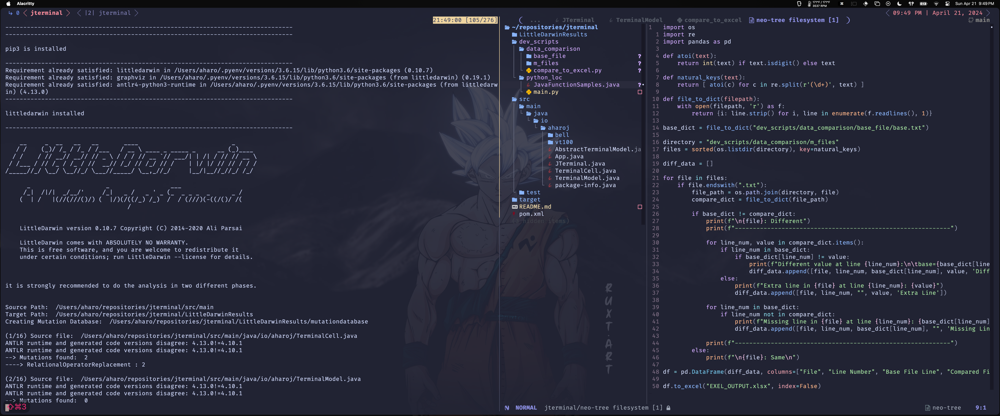

# Research Mutations Project Setup

This guide provides instructions for setting up and running the Research Mutations project on macOS or Ubuntu Linux environments. Ensure that you follow these steps after cloning the repository to your local machine.



## Prerequisites

- Java 17
- Maven
- Python 3
- Pip

---

## Installation

### 1. Clone the Repository

Before running the setup script, you need to clone the Research Mutations repository:

```bash
git clone https://github.com/aharoJ/Jterminal.git
```

```
cd Jterminal
```

### 2. Run Setup Script

From the root directory of the cloned repository, run the following command to execute the setup script:

```bash
./setup.sh
```

This script performs several actions:

- Checks if you have the correct version of Java installed.
- Executes Maven commands to clean, compile, and package the application.
- Ensures Python 3 and pip are installed.
- Installs the LittleDarwin mutation testing tool.

### script outputs

a M2.txt

> depending on your hardware, it can take 1 min to 10 min

---

## Usage

After completing the setup, the project should be fully configured. You can start using the Research Mutations tools according to the project's intended usage patterns.

### Running LittleDarwin Mutation Tests

To run mutation tests with LittleDarwin, use the following command in the project's root directory:

```bash
python3 -m littledarwin -m -b -t ./ -p ./src/main
```

This command executes the mutation testing process on the specified source directory.

---

## Support

For support with the setup or any questions regarding the usage of the tools, please open an issue on the GitHub repository or contact the project maintainers directly.
Contributing

Contributions to the Jterminal Mutation Research project are welcome. Please fork the repository and submit pull requests with any enhancements or bug fixes. If you would like to work directory with
[Dr.Ayad](https://www.kean.edu/academics/college-science-mathematics-and-technology/department-computer-science-and-technology-1) please email her.

---

## Dev Tools

### data_comparison

> for researchers

- input the base file/(s) within the `base_file` directory
- input the m_files within the `m_files` directory

### python_loc

- reads lines of code in TOTAL
- read lines of code per FUNCTION
- returns all functions LOC && total LOC per class
